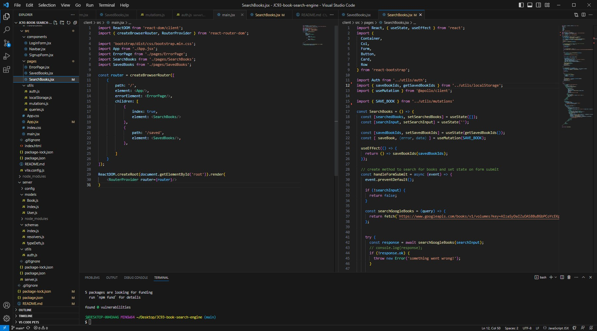

# Justin's Book Search Engine

## Technologies Used
| Javascript     || (https://developer.mozilla.org/en-US/docs/Web/JavaScript) |
| Mongoose       || (https://mongoosejs.com/)                                 |
| MongoDB        || (https://www.mongodb.com/)                                |
| React          || (https://react.dev//)                                     |
| React DOM      || (https://legacy.reactjs.org/docs/react-dom.html)          |
| Vite           || (https://vitejs.dev/)                                     |
| Apollo GraphQL || (https://new.apollographql.com/)                          |

## Description
We were assigned the task of refactoring a book search engine application by replacing it's RESTFUL API system with one that utlizes MERN Stack.

## Learning Experience
Working on this project was a great opportunity to practice working graphQL, Apollo and React.jsx. To be more specific, I learned quite a bit about writing out typeDefs, queries and mutations within resolvers, authMiddleware, gql strings, and moving around elements dynamically through the use of React's DOM and React's Router DOM. 

## Credits 
* [LinkedIn](https://linkedin.com/in/justinchoica)
* [Github](https://github.com/justinschoi93)
* [Email](justinschoi93@gmail.com)
